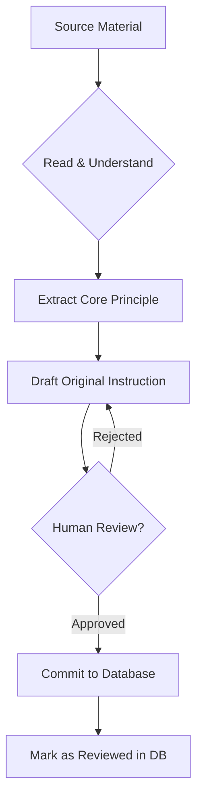

# 🏗️ Hayl Project Plan

> **Mission**: Create a premium Gym & Nutrition Webapp tailored for Ethiopia (Addis Ababa), featuring scientific workout plans (derived from expert sources), advanced timers, and myth-busting nutrition guides, powered by Bun, Elysia, Convex, and Telebirr.

## 📊 Project Status Overview

| Phase                        | Focus                                                     | Status             |
| :--------------------------- | :-------------------------------------------------------- | :----------------- |
| **I. Foundation**            | Repo, Stack, CI/CD, Safety                                | ✅ **COMPLETED**   |
| **II. The Engine**           | Data Schema, Content Seeding, Quote Bank, Standard Splits | ✅ **COMPLETED**   |
| **III. Workout UI**          | Evaluation, Active Timer, Asset Lazy-loading              | ✅ **COMPLETED**   |
| **IV. Nutrition (ET)**       | Addis-specific Foods, CICO Calc, Myth Busting             | ✅ **COMPLETED**   |
| **V. UX Interface Overhaul** | Complete UI Redesign, Design System, Component Lib        | ✅ **COMPLETED**   |
| **VI. Routine Management**   | Active Plan Logic, Classified Selection, Dashboard 2.0    | 🚧 **IN PROGRESS** |
| **VII. Monetization**        | Telebirr Integration, Premium Locking                     | ⏳ **PENDING**     |

---

## 📅 Detailed Implementation Phases

### ✅ PHASE I: Foundation & Infrastructure

**Goal**: Establish a safe, type-safe, and deployable codebase.

- [x] **Repo Setup**: Monorepo with Bun workspaces (`apps/web`, `apps/server`).
- [x] **Tech Stack**: ElysiaJS (Backend), React+Tailwind (Frontend), Convex (DB).
- [x] **Safety Gates**:
  - [x] `ANTIGRAVITY_RULES.md` established.
  - [x] Asset ingestion audit logging (`scripts/ingest-assets.ts`).
  - [x] Telebirr signature stub & failing tests.
- [x] **CI/CD**: GitHub Actions for Frontend (Pages) and Backend (Fly/Docker).

---

### 🚀 PHASE II: Data Modeling & Content Engine

**Goal**: Structure complex workout splits and create the "Quote Bank".
_Decision: Hybrid Data Approach. Static content (Plans/Quotes) in Convex (cached), User Progress in LocalStorage + Sync._

#### 2.1 Data Engine & Schema (Type-Safe)

- [x] **Refine `convex/schema.ts`**:
  - **Programs**: `slug`, `title` (e.g., "The HTLT Guide").
  - **DerivedPlans**: The CORE complexity engine. Add `variant` metadata.
  - **Workouts**: Nested arrays `days` -> `phases` -> `items`.
  - **Assets**: Strict asset pipeline.
- [x] **Quote Bank System**:
  - Create `quotes` table with tags: `motivational`, `funny`, `coach-greg`, `exercise-specific` (e.g., curls).
- [x] **Asset Pipeline**:
  - Finalize `scripts/ingest-assets.ts` to map exercises to lazy-loaded GIFs/Video URLs. `.gif` (10x smaller).
  - **Ingest Enforcement**: Script must record `robots.txt` check result and TOS URL.

#### 2.2 Content Creation (The "One by One" Standard)

- [x] **Manual Drafting Phase**:
  - **Constraint**: NO verbatim copying. All instructions must be re-written in original voice.
  - **Process**: Read source -> Understand Principle -> Write Original Instruction -> Implement.
  - **Review**: Human verification of every single exercise description.
- [x] **Create "The Hayl Standard" Plans**:
  - **Sister/Mom Guide**: Digitize the original PDF logic (Beginner friendly).
  - **Derived Architectures**: Create fresh plans _inspired by_ proven splits (e.g., HTLT structure, PPL) but with fully original strings.
  - **Variations**: Manually craft "Hard" vs "Medium" logic sets.

#### 📝 Manual Planning Workflow (DETAILED)

> **The Philosophy**: We do NOT copy. We do NOT auto-generate. We READ, UNDERSTAND, and REWRITE in our own voice.
> Every single exercise description, every tip, every quote MUST pass human review.

#### Step-by-Step Process

| Step | Action      | Details                                                                |
| :--- | :---------- | :--------------------------------------------------------------------- |
| 1    | **SOURCE**  | Identify the reference (PDF, book, guide).                             |
| 2    | **READ**    | Read the relevant section thoroughly. Understand the WHY.              |
| 3    | **EXTRACT** | Note the core principle (e.g., "compound movements before isolation"). |
| 4    | **DRAFT**   | Write the instruction in YOUR OWN WORDS. No copy-paste.                |
| 5    | **COMPARE** | Ensure your draft conveys the same message but with original phrasing. |
| 6    | **REVIEW**  | A human (you or a teammate) must approve the final text.               |
| 7    | **COMMIT**  | Add to seed script with `requires_human_review: false` after approval. |
| 8    | **LOG**     | Record `source_refs` linking back to the original material.            |

#### Workout Plan Variations Matrix

Plans are organized by a 3D matrix:

| Axis           | Options                                           |
| :------------- | :------------------------------------------------ |
| **Difficulty** | Medium, Hard                                      |
| **Split**      | 2-day, 3-day, 4-day, 2-day×2, 2-day×4, 3-day×2    |
| **Duration**   | 60-min, 90-min                                    |
| **Level**      | Amateur (First Timer), Intermediate, Elite/Expert |

This creates a large combination space. Each combination requires:

- A unique `slug` (e.g., `intermediate-3day-90min-hard`)
- A unique `derivedPlan` entry
- Manually drafted day-by-day phases

#### Quote Bank Guidelines

Quotes should be:

- **Contextual**: Match to exercise type (e.g., curls quote for bicep exercises).
- **Original or Attributed**: If quoting a source, attribute it. If original, mark as `author: "Hayl"`.
- **Varied Tone**: Mix motivational, funny, and technical.

Example from Coach Greg: _"Cheat on your curls, but don't cheat on your girlfriend."_

- This is attributed. Store with `author: "Coach Greg"`, `tags: ["curls", "funny"]`.

#### 2.3 Payment Infrastructure (Moved to Phase VI)

- _Refactored to Phase VI for better separation of concerns._

#### 2.4 Phase IV Standard Splits (PR #9, Issue #8) ✅

- [x] **HAYL Efficiency I**: 1-day, 30min density training. Antagonist supersets, compound-only, dumbbell-focused.
- [x] **HAYL Minimalist I**: 4-day Upper/Lower, dumbbell-only. Tempo-driven progression for home gyms.
- [x] **HAYL Power-Builder I**: 4-day Upper/Lower blending heavy strength (3-6 reps) with hypertrophy volume (8-15 reps).
- [x] **Database Performance**: Added 5 indexes (`exercises.by_name`, `quotes.by_text`, `programs.by_published`, `ingredients.by_name`, `ingredients.by_isLocal`). All `.filter()` → `.withIndex()` for O(1) lookups.
- [x] **Type Safety Audit**: Removed all `as` casts, unused imports, dead code. Strict mode — 0 errors.

---

### ⏱️ PHASE III: The Active Workout Experience

**Goal**: A best-in-class "Active Mode" tailored for the gym floor.

#### 3.1 Architecture & Navigation

- [x] **Split Selector**: UI to choose frequency (2-day, 3-day, 4-day) and duration.
- [x] **Tabs System**:
  - _Top Level_: Split Days (Day 1, Day 2...).
  - _Sub Level_: Phases (Warmup, Workout, Stretch).

#### 3.2 The "Hyper-Timer"

- [x] **Wake Lock**: Implement `Screen Wake Lock API` to prevent phone sleeping during workouts.
- [x] **Global Timer**: Tracks total session duration.
- [x] **Set Timer (Smart)**:
  - Interactive "Done" button for sets.
  - Auto-starts rest timer based on intensity (e.g., 90s for compounds, 60s for iso).
  - "Too fast/Too slow" feedback toasts based on user input time.

### UI/UX Micro-Interactions

- **Athletic Clean**: Fluid transitions, large touch targets.
- **Haptics**: Vibrate on timer completion.
- **Lazy Loading**: `IntersectionObserver` for all Videos/GIFs.

#### 3.3 Interactive Cards

- [x] **Exercise Card**:
  - Lazy-loaded GIF cover.
  - Collapsible "Pro Tips" (Video embed/Text).
  - **Quote Injection**: Display a random context-aware quote (e.g., "Cheat on your curls...").
  - Input fields for Weight/Reps (Human readable: "10kg", "Plate + 5").

---

### ✅ PHASE IV: Nutrition (Ethiopia Edition)

**Goal**: Science-based nutrition adapted for Addis Ababa markets.

#### 4.1 "The Truth" Knowledge Base

- [x] **Myth Buster UI**:
  - Interactive "Fact vs. Cap" section.
  - Topics: "Fasted Cardio", "Dirty Bulk", "Spot Reduction".
  - Explanation: "It's just CICO (Calories In/Calories Out)".
- [x] **Calculator**:
  - TDEE Calculator adjusted for activity level.
  - Goals: Cut, Bulk (Clean), Maingain.
  - **Unit Converter**: "Sinig/Unit" guesstimator for local Addis measurements.

#### 4.2 Meal Plans (Addis Context)

- [x] **Ingredient Database**:
  - Teff, Shiro, Injera, local beef, eggs (price/macro estimates).
- [ ] **Budget Toggles**:
  - Low Cost (Lentils/Shiro focus) vs. Premium (Chicken breast/Imported whey).

---

### ✅ PHASE V: UX Interface Overhaul

> **Goal**: Complete redesign of the UI/UX to a premium, cohesive, and responsive experience.

#### 5.1 Design System & Components

- [x] **Design Tokens**: "Warm Stone" palette, No-Shadow rules, "Athletic Editorial" typography.
- [x] **Component Library**:
  - `Button`, `Card`, `Badge`, `Input` (Custom, no specific lib deps).
  - `Tabs` (Framer Motion rooted).
  - `BottomSheet` (Mobile-first modal replacement).
- [x] **Layout Architecture**:
  - `NavBar`: Responsive (Bottom on Mobile, Side on Desktop).
  - `Page`: Standardized container.

#### 5.2 Responsive Layout Strategy

- [x] **Mobile-First**: Bottom navigation, touch targets > 44px.
- [x] **Desktop**: Sidebar navigation transition.

---

### 🚧 PHASE VI: Routine Management

> **Goal**: Allow users to commit to specific workout plans and track progress.

#### 6.1 Backend Logic (Completed)

- [x] **Schema**: Added `activePlanId` and `programStartDate` to `users`.
- [x] **Sync**: Implemented `syncUserProfile` mutation.

#### 6.2 Selection UI (Completed)

- [x] **Program Explorer**: Added "Classified Selection" (Essentials, Hybrid, Elite).
- [x] **Activation**: "Activate Routine" button in Program Guide.

#### 6.3 Active Dashboard (In Progress)

- [x] **"My Routine" Card**: Shows current plan, difficulty, and week progress.
- [ ] **Next Workout Logic**: Smart link to the specific next session.

---

### 💎 PHASE VII: Monetization & Accounts

**Goal**: Premium features for sustainability.

#### 7.1 Telebirr Integration

- [x] **Implement Webhook**:
  - Replace `verifyTelebirrSignature` stub with real crypto logic.
  - Handle `COMPLETED` state to flip `isPremium` flag.
- [ ] **Payment Flow**:
  - "Buy Plan" button -> Telebirr H5/App Switch.

#### 7.2 Access Control

- [ ] **Guest vs. User**:
  - _Guest_: Access to "Foundations" & General Nutrition.
  - _Premium_: Access to "Coach Greg Derived" & Advanced Timers.

---

## 🛠️ Technical Decisions & Standards

### Technical Strategy: Offline & Sync

- **Primary Store**: `IndexedDB` (via **Dexie.js**) for active sessions.
- **Sync Protocol**:
  1. `sessionId` + `lastModifiedTs` per record.
  2. **Conflict Resolution**: `RemoteLastModifiedTs` > `Local` ? Pull : Push. **Fallback**: If simultaneous edits on same set, create BOTH entries with metadata and surface conflict resolution UI. (Never silently lose data).
  3. **Audit**: Persist `changeLog[]` for session replays.

### UI/UX Design System: "Modern Athletic"

- **Style**: Clean, Editorial, High-Performance (Nike/Gymshark vibes).
- **Structure**: High whitespace, distinct content blocks, "Airy" layouts (Extra-rounded corners).
- **Typography**: **Inter** (Body/UI) + **Barlow Condensed** (Headings/Stats).
- **Theme**: Global **Light/Dark Mode** toggle.
- **Visuals**: No shadow spam. Subtle dividers. High-contrast data display. SVG Icons (No emojis).
- **Navigation**: TubeLight Navbar with framer-motion lamp animations.

### Safety Checks (Antigravity Rules)

- **Copyright**: All "Derived" plans must link to `source_refs` and pass human review.
- **CICO**: Nutrition advice must strictly adhere to thermodynamic laws (CICO). No fad diets.
- **Asset Compliance**: Every asset record MUST have `licenseType` and `robotsChecked` boolean.

---

## 🗂️ Appendix: Key Sources & References

| Source                   | Type | Use Case                         |
| :----------------------- | :--- | :------------------------------- |
| Sister/Mom Gym Guide     | PDF  | Beginner-friendly plan structure |
| Coach Greg Training Book | PDF  | Advanced splits, quote bank      |
| 21st.dev                 | Web  | Component design inspiration     |
| shadcn/ui                | Lib  | Accessible UI primitives         |

---

_Last Updated: 2026-02-15_

---

# 🚀 2026 DEFINITIVE EXECUTION PLAN (Current Active Roadmap)

> **Note**: This section supersedes conflicting items in the Legacy Plan below.
> **Role Assignment**:
>
> - **Gemini 3 Pro High**: UX Semantics, Copy, Conceptual Modeling.
> - **GPT-5.3 Codex**: Backend Logic, Implementation, Validation.

## PHASE 0 — PROGRAM DATA INTEGRITY (BACKEND ONLY)

**Agent**: GPT-5.3 Codex
**Scope**: Backend / Database / APIs ONLY

### Program

- **Goal**: Allow users to reorder their days within selected/active routines.
- **Tasks**:
  - [x] Design and implement schema changes for user-specific active routines.
  - [x] Implement persistent day ordering.
  - [x] Implement per-day streak logging.
  - [x] Add `day_order` indexing and streak persistence.
  - [x] Expose clean reorder APIs.
  - [x] Ensure reordering does NOT break streaks or history.

---

## PHASE 1 — WORKOUT MODE UX & STATE LOGIC

### PHASE 1A — UX SEMANTICS

**Agent**: Gemini 3 Pro High
**Scope**: UX / Interaction / Copy ONLY

- **New Interactions**:
  - [ ] +15s timer interaction.
  - [ ] Swipe vs Dropdown navigation logic.
  - [ ] Suggested vs Forced sets behavior.
- **Messaging**:
  - [ ] Write exact user-facing copy for granular incomplete-workout warnings.

### PHASE 1B — STATE & VALIDATION IMPLEMENTATION

**Agent**: GPT-5.3 Codex
**Scope**: Frontend Logic + Backend Validation

- **Features**:
  - [ ] Implement +15s timer increment.
  - [ ] Enable next/previous exercise navigation.
  - [ ] Allow skipping sets without blocking progress.
  - [ ] Track per-exercise and per-set completion ratios.
  - [ ] Trigger dynamic confirmation modals listing exact unfinished items on workout end.

---

## PHASE 1.5 — PROGRAM DAY REORDERING (UI)

### UX DESIGN

**Agent**: Gemini 3 Pro High
**Scope**: UX ONLY

- [ ] Design UX for reordering routine days (drag/drop vs arrows).
- [ ] Define visual feedback and edge-case handling.

### IMPLEMENTATION

**Agent**: GPT-5.3 Codex
**Scope**: Frontend Implementation

- [ ] Implement reordering UI using existing reorder APIs.
- [ ] Persist order optimistically.
- [ ] Ensure streaks and history remain correct after reorder.

---

## PHASE 2 — PROFILE & HISTORY

### PHASE 2A — UX STRUCTURE

**Agent**: Gemini 3 Pro High
**Scope**: UX / Semantics

- [ ] Decide history layout structure (collapsible, drawers, or pages).
- [ ] Define KPIs and grouping.
- [ ] Decide "kCAL" vs "CAL" terminology.

### PHASE 2B — DATA & UI IMPLEMENTATION

**Agent**: GPT-5.3 Codex
**Scope**: Backend + Frontend

- [ ] Persist all sets, averages, and KPIs.
- [ ] Implement collapsible/drawer UI.
- [ ] Fix hover color bug on laptop (light changer).
- [ ] Standardize calorie unit across system.

---

## PHASE 3 — EXERCISE BANK

**Agent**: Gemini 3 Pro High
**Scope**: Semantics

- [ ] Define authenticity criteria and sourcing rules for videos/gifs.

**Agent**: GPT-5.3 Codex
**Scope**: Backend + Tooling

- [ ] Build ingestion pipeline.
- [ ] Validate authenticity.
- [ ] Support scalable addition.

---

## PHASE 4 — FUEL SYSTEM

### PHASE 4A — MEAL SEMANTICS

**Agent**: Gemini 3 Pro High
**Scope**: UX + Conceptual Modeling

- [ ] Design composite meal mental model and UX (e.g., injera + wats).

### PHASE 4B — CALCULATION ENGINE

**Agent**: GPT-5.3 Codex
**Scope**: Backend Logic

- [ ] Normalize calorie data across units (100g vs serving).
- [ ] Implement suggestion engine based on goals/stats.
- [ ] Add hooks for adaptive future logic.

---

## PHASE 5 — PROGRESS TRACKER

**Agent**: Gemini 3 Pro High
**Scope**: UX / Messaging

- [ ] Define progress messaging and nuance (muscle gain vs fat gain).

**Agent**: GPT-5.3 Codex
**Scope**: Logic + Notifications

- [ ] Implement reminders, popups, weight updates.
- [ ] Recalculate progress and suggestions.
- [ ] Distinguish muscle vs fat gain.

---

## PHASE 6 — HOME PAGE

**Agent**: Gemini 3 Pro High
**Scope**: UX Strategy

- [ ] Decide KPI selection and layout.

**Agent**: GPT-5.3 Codex
**Scope**: Implementation

- [ ] Aggregate KPIs.
- [ ] Remove redundant Protocol button.
- [ ] Prepare analytics pipelines.

---

## PHASE 7 — PLATFORM ENHANCEMENT

**Agent**: GPT-5.3 Codex
**Scope**: Platform-specific UI

- [ ] Detect Apple support.
- [ ] Enable Liquid Glass (in-built) conditionally.
- [ ] Ensure graceful fallback.
