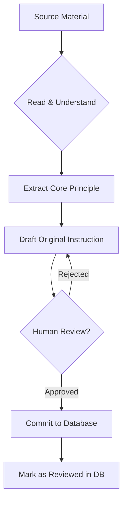

# 🏗️ Hayl Project Plan

> **Mission**: Create a premium Gym & Nutrition Webapp tailored for Ethiopia (Addis Ababa), featuring scientific workout plans (derived from expert sources), advanced timers, and myth-busting nutrition guides, powered by Bun, Elysia, Convex, and Telebirr.

## 📊 Project Status Overview

| Phase                        | Focus                                                | Status             |
| :--------------------------- | :--------------------------------------------------- | :----------------- |
| **I. Foundation**            | Repo, Stack, CI/CD, Safety                           | ✅ **COMPLETED**   |
| **II. The Engine**           | Data Schema, Content Seeding, Quote Bank             | 🚧 **IN PROGRESS** |
| **III. Workout UI**          | Evaluation, Active Timer, Asset Lazy-loading         | ✅ **COMPLETED**   |
| **IV. Nutrition (ET)**       | Addis-specific Foods, CICO Calc, Myth Busting        | ✅ **COMPLETED**   |
| **V. UX Interface Overhaul** | Complete UI Redesign, Desktop Support, Component Lib | 🔴 **NEW**         |
| **VI. Monetization**         | Telebirr Integration, Premium Locking                | 🚧 **PAUSED**      |

---

## 📅 Detailed Implementation Phases

### ✅ PHASE I: Foundation & Infrastructure

**Goal**: Establish a safe, type-safe, and deployable codebase.

- [x] **Repo Setup**: Monorepo with Bun workspaces (`apps/web`, `apps/server`).
- [x] **Tech Stack**: ElysiaJS (Backend), React+Tailwind (Frontend), Convex (DB).
- [x] **Safety Gates**:
  - [x] `ANTIGRAVITY_RULES.md` established.
  - [x] Asset ingestion audit logging (`scripts/ingest-assets.ts`).
  - [x] Telebirr signature stub & failing tests.
- [x] **CI/CD**: GitHub Actions for Frontend (Pages) and Backend (Fly/Docker).

---

### 🚀 PHASE II: Data Modeling & Content Engine

**Goal**: Structure complex workout splits and create the "Quote Bank".
_Decision: Hybrid Data Approach. Static content (Plans/Quotes) in Convex (cached), User Progress in LocalStorage + Sync._

#### 2.1 Data Engine & Schema (Type-Safe)

- [x] **Refine `convex/schema.ts`**:
  - **Programs**: `slug`, `title` (e.g., "The HTLT Guide").
  - **DerivedPlans**: The CORE complexity engine. Add `variant` metadata.
  - **Workouts**: Nested arrays `days` -> `phases` -> `items`.
  - **Assets**: Strict asset pipeline.
- [x] **Quote Bank System**:
  - Create `quotes` table with tags: `motivational`, `funny`, `coach-greg`, `exercise-specific` (e.g., curls).
- [x] **Asset Pipeline**:
  - Finalize `scripts/ingest-assets.ts` to map exercises to lazy-loaded GIFs/Video URLs. `.gif` (10x smaller).
  - **Ingest Enforcement**: Script must record `robots.txt` check result and TOS URL.

#### 2.2 Content Creation (The "One by One" Standard)

- [ ] **Manual Drafting Phase**:
  - **Constraint**: NO verbatim copying. All instructions must be re-written in original voice.
  - **Process**: Read source -> Understand Principle -> Write Original Instruction -> Implement.
  - **Review**: Human verification of every single exercise description.
- [ ] **Create "The Hayl Standard" Plans**:
  - **Sister/Mom Guide**: Digitize the original PDF logic (Beginner friendly).
  - **Derived Architectures**: Create fresh plans _inspired by_ proven splits (e.g., HTLT structure, PPL) but with fully original strings.
  - **Variations**: Manually craft "Hard" vs "Medium" logic sets.

#### 📝 Manual Planning Workflow (DETAILED)

> **The Philosophy**: We do NOT copy. We do NOT auto-generate. We READ, UNDERSTAND, and REWRITE in our own voice.
> Every single exercise description, every tip, every quote MUST pass human review.

#### Step-by-Step Process

| Step | Action      | Details                                                                |
| :--- | :---------- | :--------------------------------------------------------------------- |
| 1    | **SOURCE**  | Identify the reference (PDF, book, guide).                             |
| 2    | **READ**    | Read the relevant section thoroughly. Understand the WHY.              |
| 3    | **EXTRACT** | Note the core principle (e.g., "compound movements before isolation"). |
| 4    | **DRAFT**   | Write the instruction in YOUR OWN WORDS. No copy-paste.                |
| 5    | **COMPARE** | Ensure your draft conveys the same message but with original phrasing. |
| 6    | **REVIEW**  | A human (you or a teammate) must approve the final text.               |
| 7    | **COMMIT**  | Add to seed script with `requires_human_review: false` after approval. |
| 8    | **LOG**     | Record `source_refs` linking back to the original material.            |

#### Workout Plan Variations Matrix

Plans are organized by a 3D matrix:

| Axis           | Options                                           |
| :------------- | :------------------------------------------------ |
| **Difficulty** | Medium, Hard                                      |
| **Split**      | 2-day, 3-day, 4-day, 2-day×2, 2-day×4, 3-day×2    |
| **Duration**   | 60-min, 90-min                                    |
| **Level**      | Amateur (First Timer), Intermediate, Elite/Expert |

This creates a large combination space. Each combination requires:

- A unique `slug` (e.g., `intermediate-3day-90min-hard`)
- A unique `derivedPlan` entry
- Manually drafted day-by-day phases

#### Quote Bank Guidelines

Quotes should be:

- **Contextual**: Match to exercise type (e.g., curls quote for bicep exercises).
- **Original or Attributed**: If quoting a source, attribute it. If original, mark as `author: "Hayl"`.
- **Varied Tone**: Mix motivational, funny, and technical.

Example from Coach Greg: _"Cheat on your curls, but don't cheat on your girlfriend."_

- This is attributed. Store with `author: "Coach Greg"`, `tags: ["curls", "funny"]`.

#### 2.3 Payment Infrastructure (Moved to Phase VI)

- _Refactored to Phase VI for better separation of concerns._

---

### ⏱️ PHASE III: The Active Workout Experience

**Goal**: A best-in-class "Active Mode" tailored for the gym floor.

#### 3.1 Architecture & Navigation

- [x] **Split Selector**: UI to choose frequency (2-day, 3-day, 4-day) and duration.
- [x] **Tabs System**:
  - _Top Level_: Split Days (Day 1, Day 2...).
  - _Sub Level_: Phases (Warmup, Workout, Stretch).

#### 3.2 The "Hyper-Timer"

- [x] **Wake Lock**: Implement `Screen Wake Lock API` to prevent phone sleeping during workouts.
- [x] **Global Timer**: Tracks total session duration.
- [x] **Set Timer (Smart)**:
  - Interactive "Done" button for sets.
  - Auto-starts rest timer based on intensity (e.g., 90s for compounds, 60s for iso).
  - "Too fast/Too slow" feedback toasts based on user input time.

### UI/UX Micro-Interactions

- **Athletic Clean**: Fluid transitions, large touch targets.
- **Haptics**: Vibrate on timer completion.
- **Lazy Loading**: `IntersectionObserver` for all Videos/GIFs.

#### 3.3 Interactive Cards

- [x] **Exercise Card**:
  - Lazy-loaded GIF cover.
  - Collapsible "Pro Tips" (Video embed/Text).
  - **Quote Injection**: Display a random context-aware quote (e.g., "Cheat on your curls...").
  - Input fields for Weight/Reps (Human readable: "10kg", "Plate + 5").

---

### ✅ PHASE IV: Nutrition (Ethiopia Edition)

**Goal**: Science-based nutrition adapted for Addis Ababa markets.

#### 4.1 "The Truth" Knowledge Base

- [x] **Myth Buster UI**:
  - Interactive "Fact vs. Cap" section.
  - Topics: "Fasted Cardio", "Dirty Bulk", "Spot Reduction".
  - Explanation: "It's just CICO (Calories In/Calories Out)".
- [x] **Calculator**:
  - TDEE Calculator adjusted for activity level.
  - Goals: Cut, Bulk (Clean), Maingain.
  - **Unit Converter**: "Sinig/Unit" guesstimator for local Addis measurements.

#### 4.2 Meal Plans (Addis Context)

- [x] **Ingredient Database**:
  - Teff, Shiro, Injera, local beef, eggs (price/macro estimates).
- [ ] **Budget Toggles**:
  - Low Cost (Lentils/Shiro focus) vs. Premium (Chicken breast/Imported whey).

---

### 🎨 PHASE V: UX Interface Overhaul (NEW)

> **Goal**: Complete redesign of the UI/UX to a premium, cohesive, and responsive experience that works beautifully on **both mobile AND desktop**.

#### 5.1 Design Philosophy & Hard Rules

##### ⛔ FORBIDDEN (The "Never Do" List)

| Rule                       | Reason                                                                 |
| :------------------------- | :--------------------------------------------------------------------- |
| **No Glassmorphism**       | Blurry overlays are overdone, look cheap, and hurt performance.        |
| **No Shadows (Any Type)**  | No `box-shadow`, no `text-shadow`, no `drop-shadow`. Borders only.     |
| **No Lame Fonts**          | System fonts and basic sans-serifs are banned. Use curated typography. |
| **No Excessive Gradients** | Flat colors preferred. Gradients only for intentional accent moments.  |
| **No Emoji Icons**         | All icons MUST be SVG from a consistent library (Lucide/Heroicons).    |

##### ✅ REQUIRED (The "Always Do" List)

| Rule                            | Implementation                                                            |
| :------------------------------ | :------------------------------------------------------------------------ |
| **Mobile-First, Desktop-Ready** | Design for mobile touch first, then expand layouts for desktop.           |
| **Responsive Breakpoints**      | `sm` (640px), `md` (768px), `lg` (1024px), `xl` (1280px), `2xl` (1536px). |
| **Keyboard Accessible**         | All interactive elements must be focusable and navigable via Tab.         |
| **Touch Target 44px Min**       | All buttons and interactive elements must meet accessibility standards.   |

#### 5.2 Color System (5-Level Semantic Palette)

A strict, semantic color system with **5 levels**, where **3 have light/dark mode variants**.

| Token Name       | Purpose                        | Light Mode | Dark Mode | Has Variant?         |
| :--------------- | :----------------------------- | :--------- | :-------- | :------------------- |
| `--hayl-bg`      | Page background                | `#FDFDFD`  | `#09090B` | ✅ Yes               |
| `--hayl-surface` | Card/Container background      | `#FFFFFF`  | `#18181B` | ✅ Yes               |
| `--hayl-text`    | Primary text color             | `#09090B`  | `#FAFAFA` | ✅ Yes               |
| `--hayl-muted`   | Secondary/Disabled text        | `#71717A`  | `#A1A1AA` | ❌ No (Zinc neutral) |
| `--hayl-accent`  | CTAs, Highlights (Brand Color) | `#FF4D00`  | `#FF4D00` | ❌ No (Fixed)        |

**Usage Rules**:

- `bg`: Only for the outermost `<body>` or main container.
- `surface`: For cards, modals, sheets.
- `text` / `muted`: For typography.
- `accent`: Sparingly, for primary buttons and key highlights only.
- **Borders**: Use `--hayl-muted` at 10-20% opacity for subtle dividers.

#### 5.3 Typography Stack

| Token            | Font Family        | Use Case                         |
| :--------------- | :----------------- | :------------------------------- |
| `--font-sans`    | `Inter`            | Body text, UI elements           |
| `--font-heading` | `Barlow Condensed` | Headlines, Section titles, Stats |
| `--font-mono`    | `JetBrains Mono`   | Code blocks, Timer displays      |

**Rules**:

- Headings: **Bold, Italic, Uppercase, Tight Tracking** (`font-black italic uppercase tracking-tighter`).
- Body: Regular weight, ample line-height (`leading-relaxed`).
- Data/Numbers: Monospace for timers and counters.

#### 5.4 Component Strategy (21st.dev + shadcn/ui)

We will use **shadcn/ui** as a base for accessible, unstyled primitives and source inspiration from **21st.dev** for premium patterns, then **heavily customize** to match our design system.

**Component Adoption Workflow**:

1. **IDENTIFY**: Find a primitive in shadcn/ui (e.g., Dialog, Tabs, Accordion).
2. **COPY**: Install/copy the component into `apps/web/src/components/ui/`.
3. **STRIP**: Remove ALL default Tailwind classes (especially shadows, rounded-lg, etc.).
4. **REBRAND**: Apply Hayl design tokens (--hayl-\*, font-heading, etc.).
5. **DOCUMENT**: Add JSDoc comments and usage examples.
6. **TEST**: Verify accessibility (keyboard nav, focus rings, ARIA).

**Core UI Components to Build/Customize**:

| Component      | Source   | Priority | Notes                                       |
| :------------- | :------- | :------- | :------------------------------------------ |
| `Button`       | shadcn   | P0       | Primary, Secondary, Ghost, Link variants.   |
| `Card`         | Custom   | P0       | No shadow. Border only. Rounded-2xl/3xl.    |
| `Tabs`         | shadcn   | P0       | For Day/Phase navigation.                   |
| `Dialog/Sheet` | shadcn   | P0       | For modals and bottom sheets.               |
| `Input`        | shadcn   | P1       | For weight/reps entry. Large touch targets. |
| `Accordion`    | shadcn   | P1       | For collapsible tips and exercise info.     |
| `Timer`        | Custom   | P0       | Custom build for workout timers.            |
| `Navbar`       | 21st.dev | P0       | "Tubelight" style bottom nav.               |
| `Toast`        | shadcn   | P2       | For feedback messages.                      |

#### 5.5 Responsive Layout Strategy

**Mobile (Default)**:

- Single Column: Stacked content, full-width cards.
- Bottom Navigation: Persistent navbar for Workout, Exercises, Nutrition, Profile.
- Floating Action Button (FAB): For primary actions like "Start Workout".

**Desktop (lg+)**:

- Two/Three Column Grids: Utilize horizontal space.
- Sidebar Navigation: Convert bottom nav to a fixed left sidebar.
- Sticky Headers: Keep context visible while scrolling.
- Hover States: Add subtle hover effects for interactive elements (no shadow, use border/bg change).

---

### 💎 PHASE VI: Monetization & Accounts

**Goal**: Premium features for sustainability.

#### 6.1 Telebirr Integration

- [x] **Implement Webhook**:
  - Replace `verifyTelebirrSignature` stub with real crypto logic.
  - Handle `COMPLETED` state to flip `isPremium` flag.
- [ ] **Payment Flow**:
  - "Buy Plan" button -> Telebirr H5/App Switch.

#### 6.2 Access Control

- [ ] **Guest vs. User**:
  - _Guest_: Access to "Foundations" & General Nutrition.
  - _Premium_: Access to "Coach Greg Derived" & Advanced Timers.

---

## 🛠️ Technical Decisions & Standards

### Technical Strategy: Offline & Sync

- **Primary Store**: `IndexedDB` (via **Dexie.js**) for active sessions.
- **Sync Protocol**:
  1. `sessionId` + `lastModifiedTs` per record.
  2. **Conflict Resolution**: `RemoteLastModifiedTs` > `Local` ? Pull : Push. **Fallback**: If simultaneous edits on same set, create BOTH entries with metadata and surface conflict resolution UI. (Never silently lose data).
  3. **Audit**: Persist `changeLog[]` for session replays.

### UI/UX Design System: "Modern Athletic"

- **Style**: Clean, Editorial, High-Performance (Nike/Gymshark vibes).
- **Structure**: High whitespace, distinct content blocks, "Airy" layouts (Extra-rounded corners).
- **Typography**: **Inter** (Body/UI) + **Barlow Condensed** (Headings/Stats).
- **Theme**: Global **Light/Dark Mode** toggle.
- **Visuals**: No shadow spam. Subtle dividers. High-contrast data display. SVG Icons (No emojis).
- **Navigation**: TubeLight Navbar with framer-motion lamp animations.

### Safety Checks (Antigravity Rules)

- **Copyright**: All "Derived" plans must link to `source_refs` and pass human review.
- **CICO**: Nutrition advice must strictly adhere to thermodynamic laws (CICO). No fad diets.
- **Asset Compliance**: Every asset record MUST have `licenseType` and `robotsChecked` boolean.

---

## 🗂️ Appendix: Key Sources & References

| Source                   | Type | Use Case                         |
| :----------------------- | :--- | :------------------------------- |
| Sister/Mom Gym Guide     | PDF  | Beginner-friendly plan structure |
| Coach Greg Training Book | PDF  | Advanced splits, quote bank      |
| 21st.dev                 | Web  | Component design inspiration     |
| shadcn/ui                | Lib  | Accessible UI primitives         |

---

_Last Updated: 2026-02-08_
